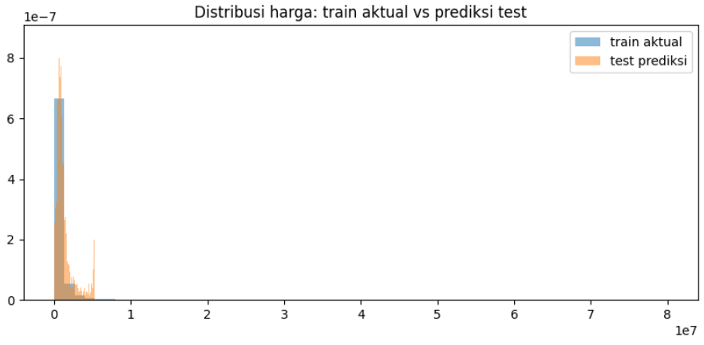

# HoloMine Property Price Prediction From Sales Description

NLP regression: predict `listPrice` from unstructured property listing text only. **Metric: MAE (lower is better).**

  

## Competition

Predict the listing price from free-text sales descriptions (varied style, ~14.6k train rows, heavily right-skewed target with skew ≈ 15.3 → modeled in `log1p` space).

- Input: `id,text` (test has no price)
- Target: `listPrice`
- Metric: **MAE** on the original price scale
- Submission: `id,listPrice`, same row order as `sample_submission.csv`

> Full raw CSVs are not included (competition data). `data_sample/` shows the schema; see Reproduce to run on your own copy.

## Technical overview

Pipeline in `src/holomine_transformer_cells.py` (one file, `# %% CELL N` blocks map to Kaggle notebook cells, run in order):

- **Validation (CELL 2):** `StratifiedKFold(5, seed=42)` over 10 `qcut` price bins on `log1p(price)` → `folds.csv` frozen once; every experiment reuses the same folds. Zero train/test id overlap asserted.
- **DeBERTa-v3-base + regression head (CELL 3):** log1p target + per-fold centering, **mean pooling** (not CLS), L1 loss aligned with MAE, effective batch 16, lr 2e-5, 3 epochs, cosine + 10% warmup, fp16 AMP, dropout 0.1, dynamic padding, `expm1 + clip` at predict time. Key fix: v1 with CLS pooling scored 659k CV-MAE   *worse* than the 550k median baseline   because DeBERTa-v3's MLM `[CLS]` is a weak sentence representation; mean pooling + centering brought v2 to ~355k.
- **TF-IDF (100k, 1–2gram, sublinear, min_df=2) + Ridge α=0.5 (CELL 3B):** CPU, ~2 min, CV-MAE ~347k   the cheap safety net that beat the transformer alone.
- **Regex domain features + LightGBM L1 (CELL 3D):** beds/baths/sqft/acre/lot/HOA/year/garage + flags (pool, waterfront, renovated, fixer, luxury, view) + length features; CV-MAE ~460k standalone, kept for blend diversity.
- **ModernBERT-base (CELL 7):** same setup as CELL 3 for architecture diversity.
- **Blend (CELL 5/8):** simplex grid (step 20, weights ≥ 0, sum 1) optimized on leak-free OOF; final test prediction = fold-mean (not refit-full   14.6k rows is small, fold-mean is more robust and free ensembling); clip to train [min, max]; full asserts (columns/rows/order/NaN/inf/range/ids) + distribution sanity plot.

Full protocol in [`docs/METHOD.md`](docs/METHOD.md).

## Results

CV-MAE on the original price scale:

| Experiment | CV-MAE | Note |
|------------|--------|------|
| Median baseline | ~550,252 | CV zero point |
| DeBERTa v1 (CLS, no centering) | 659,867 (LB 732,654) | lost to baseline → diagnosed, fixed |
| TF-IDF + Ridge α=0.5 | ~346,772 | best single, cheapest |
| DeBERTa v2 (mean-pool + centering) | 354,855 clean run | main transformer |
| LightGBM regex FE | 459,963 | diversity only (~800 blend gain ≪ 30k std = tie) |
| **Simplex blend (CELL 5)** | **OOF 336,815** | **final; kept old 429k-LB submission as fallback** |



*Sanity check: predicted test distribution overlaps the skewed train distribution   no crazy drift.*

## Reproduce

```bash
pip install -r requirements.txt
```

- **CPU (~2 min):** run CELL 1 (audit + median baseline), CELL 2 (frozen folds), CELL 3B (TF-IDF + Ridge) → `submission_ridge.csv`.
- **CPU (~15 min):** CELL 3D (regex + LightGBM).
- **GPU:** CELL 3 (DeBERTa, smoke test 1 fold first), CELL 7 (ModernBERT), then CELL 5/8 (blend + asserts). Keeps the old `submission.csv` untouched   the blend writes a separate file so the 429k-LB fallback survives.

Kaggle setup: Accelerator = GPU, Internet = ON (HuggingFace download), attach `train.csv` / `test.csv` / `sample_submission.csv` as a dataset.

## File map

```
src/holomine_transformer_cells.py  # full pipeline (CELL 1→8): baseline, folds, DeBERTa, Ridge, LGBM, ModernBERT, blend, decision log
data_sample/                       # 5-row heads + sample_submission (schema only)
assets/distribution_train_vs_pred.png  # train-vs-pred sanity histogram
docs/METHOD.md                     # validation/ensembling protocol + decision log
```

## What I learned

- A 2-minute Ridge baseline (~347k) beat a GPU transformer (659k) until the pooling bug was fixed   cheap baselines first, always.
- CLS is not a sentence embedding for MLM models like DeBERTa-v3; mean pooling + target centering was the whole fix.
- Blend weights must be optimized on OOF, and the final model must be fold-mean   selecting by public LB is how small-data projects overfit.
